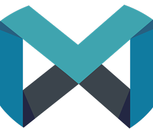

# Byte-Me-Megathon-23
This gitrepo is for the team members of the team "Byte Me" to collaborate on their project for megathon'23

  

## Introduction

Welcome to Megathon - the ultimate hackathon organized by IIITH! In this hackathon, our team, **Byte Me** - consisting of Vinit Mehta, Medha Prasad, Vyakhya Gupta, and Pearl Shah, took on the challenge of creating a medical chatbot to assist doctors in suggesting treatments. We leveraged Hugging Face's Language Model (LLM) and utilized a specially provided dataset by the organizing company.

## Project Overview

### Problem Statement

The primary objective of our project was to develop a medical chatbot that can streamline communication between doctors and patients. The chatbot aimed to assist doctors in suggesting treatment based on the symptoms presented by the patients.

### Technologies Used

- **Hugging Face LLM Models:** We harnessed the power of Hugging Face's Language Model (LLM) to create a sophisticated and context-aware chatbot.
- **Python:** The entire project was implemented using Python, taking advantage of its rich ecosystem of libraries and tools.
- **Dataset:** We utilized the dataset provided by the organizing company, ensuring that our chatbot was trained on relevant and accurate medical information.

## Team Members

- **Vinit Mehta**
- **Medha Prasad**
- **Vyakhya Gupta**
- **Pearl Shah**
## Acknowledgments

We would like to express our gratitude to the organizers of Megathon for providing us with the opportunity to work on this challenging and impactful project. Additionally, we appreciate the support and resources provided by Hugging Face and the dataset company.

## License

---

Feel free to explore our codebase and adapt it for your needs. If you have any questions or suggestions, don't hesitate to contact us. Happy hacking! 🚀

Link to Colab notebook : https://colab.research.google.com/drive/1EM_p_Kn5I2y0LdhKOCL6QCFOa7IpQBPS?usp=sharing
